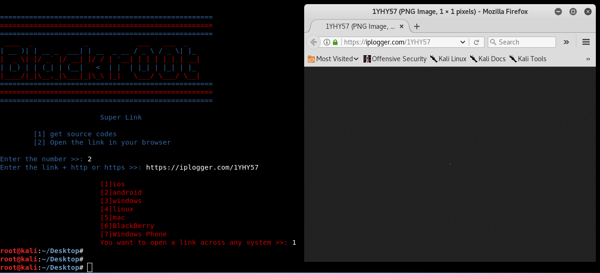
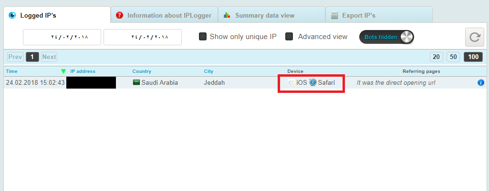

# Super Link

 

 
 

 

 
<pre>use python2</pre>
<pre>git clone https://github.com/korsanye/Super-Link.git && cd Super-Link </pre>
<pre>python -m pip install -r requirements.txt </pre>
<pre>python Super_Link.py</pre>

 

  Download the latest version of geckodriver from <a href="https://github.com/mozilla/geckodriver/releases">here</a>. Add the geckodriver.exe file to the Supr-Link directory.

YouTube : https://www.youtube.com/channel/UCQKMd8MZdk6dn7qjaIj47Hg/videos?view_as=subscriber

instagram : https://www.instagram.com/8mkj

# Super Link
